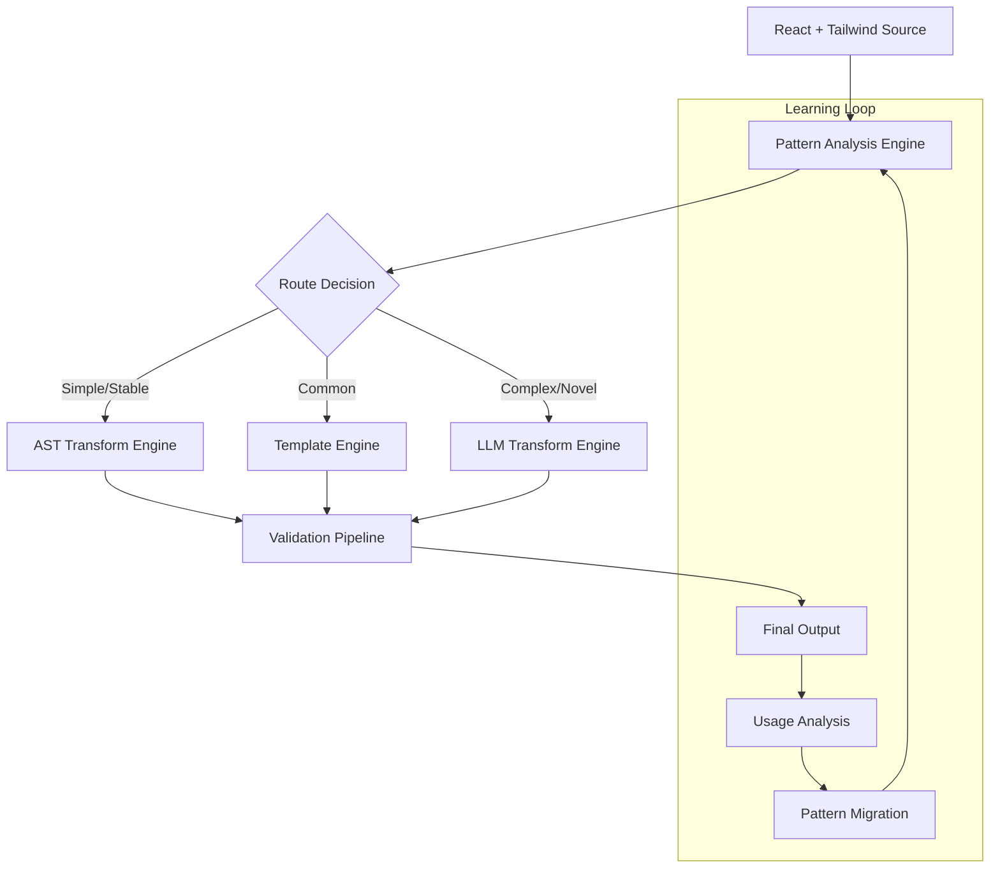

# Transpilation Architecture Plan

## Overview

This document outlines the architectural approach for building a comprehensive transpilation system that converts React + Tailwind skins to multiple output formats, with HTML + Vanilla CSS being the primary initial target.

## Problem Statement

We need to transpile React components and skins to equivalent implementations across different platforms while maintaining functionality and design consistency. The transpilation involves complex architectural pattern changes beyond simple syntax transformations.

### Target Matrix

| Input Format | Output Formats |
|-------------|----------------|
| **React + Tailwind** | → HTML + Vanilla CSS |
| React + Tailwind | → React + Tailwind (passthrough) |
| React + Tailwind | → React + CSS Modules |
| React + Tailwind | → React + Vanilla CSS *(future)* |

### Complexity Analysis

Based on the existing transpilation context, transformations include:
- **Architectural patterns**: React hooks → HTML web component classes
- **Import statements**: Package mappings and dependency updates
- **Component syntax**: JSX → HTML template literals
- **Naming conventions**: PascalCase → kebab-case with prefixes
- **Event handling**: Inline handlers → class methods
- **State management**: Hook patterns → state definition objects
- **Template structure**: React children → slot-based rendering

## Architectural Approaches Evaluated

### 1. Extended AST-Based Compiler with Location Tracking
**Assessment: Poor Fit**
- ✅ Deterministic and fast
- ❌ Extremely complex for architectural pattern changes
- ❌ Fragile to code variations
- ❌ Text replacement approach error-prone

### 2. Full Compiler with Advanced Build Tooling
**Assessment: Technically Superior but Impractical**
- ✅ Robust and mature tooling
- ✅ Proper AST transformations
- ❌ Massive engineering effort (months)
- ❌ Inflexible for evolving patterns

### 3. LLM + Build Tooling Hybrid
**Assessment: Best Fit for Current Problem**
- ✅ Excellent pattern recognition for complex transformations
- ✅ Handles edge cases gracefully
- ✅ Adapts to new patterns without code changes
- ✅ Fast to implement initial versions
- ❌ Non-deterministic output
- ❌ Cost and latency considerations

### 4. Template-Based Transformation System
**Assessment: Good Complement**
- ✅ Declarative and maintainable
- ✅ Fast for matched patterns
- ❌ Limited to predefined patterns
- ❌ Pattern explosion as requirements grow

### 5. Schema-Driven Code Generation
**Assessment: Interesting but Limited**
- ✅ Data-driven transformations
- ✅ Multiple target generation
- ❌ Limited expressiveness
- ❌ Doesn't handle novel patterns

## Recommended Solution: Layered Hybrid Approach

### Core Philosophy
- **Start with LLM strength** in pattern recognition and context understanding
- **Add deterministic layers** as patterns stabilize
- **Maintain graceful degradation** for edge cases
- **Optimize costs and performance** over time

### Architecture Evolution



## Implementation Phases

### Phase 1: LLM-Centric Foundation (Immediate - 2-4 weeks)

**Objectives:**
- Establish working end-to-end transpilation pipeline
- Build validation and quality assurance infrastructure
- Create structured prompt system
- Collect usage data and common patterns

**Core Components:**

#### 1.1 Enhanced LLM Integration
```typescript
interface TranspilationEngine {
  transpile(input: SourceFile, targetFormat: OutputFormat): Promise<TranspiledOutput>
  validateOutput(output: TranspiledOutput): ValidationResult
  retryOnFailure(input: SourceFile, previousAttempt: string): Promise<TranspiledOutput>
}
```

**Implementation Details:**
- Extend existing LLM POC with structured input/output handling
- Integrate transpilation context document as system prompt
- Add retry logic with error context for failed attempts
- Implement streaming for large file handling

#### 1.2 Validation Pipeline
```typescript
interface ValidationPipeline {
  syntaxCheck(code: string): SyntaxResult
  typeCheck(code: string): TypeCheckResult
  semanticValidation(code: string, originalIntent: string): SemanticResult
  executeTests(code: string): TestResult
}
```

**Validation Steps:**
1. **Syntax Validation**: TypeScript/JavaScript parsing
2. **Type Checking**: Ensure generated code compiles
3. **Import Validation**: Verify all imports resolve correctly
4. **Semantic Checks**: Basic correctness (component names, structure)
5. **Integration Tests**: Generated code works with existing system

#### 1.3 Integration with Existing Compiler
- Connect with current Tailwind CSS compiler pipeline
- Use existing AST parsing for input analysis
- Generate CSS alongside transpiled components
- Maintain file structure and naming conventions

**Success Metrics:**
- 90%+ successful transpilation rate for existing skin patterns
- Generated code compiles and passes basic tests
- End-to-end pipeline from React source to deployable HTML components

### Phase 2: Template Acceleration (Medium-term - 2-3 months)

**Objectives:**
- Optimize performance for common transformation patterns
- Reduce LLM costs and improve reliability
- Create maintainable transformation rules

**Core Components:**

#### 2.1 Pattern Analysis System
```typescript
interface PatternAnalyzer {
  extractPatterns(usageData: TranspilationLog[]): TransformationPattern[]
  scorePatterns(patterns: TransformationPattern[]): PatternScore[]
  recommendTemplateCandidate(pattern: TransformationPattern): TemplateCandidate
}
```

**Pattern Categories:**
- **Import Transformations**: Package mapping rules
- **Component Mappings**: Simple PascalCase → kebab-case conversions
- **Attribute Transforms**: camelCase → kebab-case with value mappings
- **Structure Patterns**: Common component composition patterns

#### 2.2 Template Engine
```typescript
interface TemplateEngine {
  createTemplate(pattern: TransformationPattern): Template
  applyTemplate(template: Template, input: SourceNode): string
  validateTemplate(template: Template, testCases: TestCase[]): TemplateValidation
}
```

**Template Types:**
- **Regex-based**: Simple string pattern replacements
- **AST-based**: Structured transformations for syntax changes
- **Hybrid**: Combination for complex but predictable patterns

#### 2.3 Routing Logic
```typescript
interface TransformationRouter {
  analyzeComplexity(input: SourceFile): ComplexityScore
  selectApproach(complexity: ComplexityScore): TransformationApproach
  routeToEngine(approach: TransformationApproach, input: SourceFile): Promise<TranspiledOutput>
}

enum TransformationApproach {
  TEMPLATE_FAST,
  TEMPLATE_COMPLEX,
  LLM_STANDARD,
  LLM_COMPLEX
}
```

**Success Metrics:**
- 60%+ of common patterns handled by templates
- 50%+ reduction in LLM API costs
- 80%+ improvement in processing speed for template-handled cases
- Template accuracy matches LLM quality for covered patterns

### Phase 3: AST Hardening (Long-term - 6+ months)

**Objectives:**
- Move most stable patterns to deterministic AST transforms
- Achieve production-grade reliability and performance
- Create learning system for continuous improvement

**Core Components:**

#### 3.1 AST Transformation Engine
```typescript
interface ASTTransformEngine {
  registerTransform(pattern: TransformationPattern, transform: ASTTransform): void
  applyTransforms(sourceAST: SourceNode): TransformedNode
  validateTransform(transform: ASTTransform, testCases: TestCase[]): ValidationResult
}
```

**Transform Categories:**
- **Structural**: Component architecture changes
- **Syntactic**: Language construct conversions
- **Semantic**: Meaning-preserving optimizations

#### 3.2 Confidence Scoring System
```typescript
interface ConfidenceScorer {
  scorePattern(input: SourceNode): ConfidenceScore
  recommendApproach(score: ConfidenceScore): TransformationApproach
  updateScores(feedback: TransformationFeedback): void
}
```

#### 3.3 Learning and Migration System
```typescript
interface PatternLearningSystem {
  identifyStablePatterns(usageHistory: TransformationLog[]): StablePattern[]
  generateASTTransform(pattern: StablePattern): ASTTransform
  migrateFromLLMToAST(pattern: StablePattern): MigrationResult
}
```

**Success Metrics:**
- 80%+ of transformations handled by AST/templates
- Sub-second processing for most common cases
- 99%+ deterministic accuracy for migrated patterns
- Self-improving system that requires minimal manual intervention

## Target Format Implementation

### HTML + Vanilla CSS (Phase 1 Priority)
- **CSS Integration**: Use existing Tailwind compiler output
- **Component Structure**: Web component class definitions
- **Template Generation**: HTML template literals with slot patterns
- **Import Management**: Package mapping and dependency resolution

### React + CSS Modules (Phase 2)
- **CSS Import Injection**: Add CSS module imports to React components
- **ClassName Mapping**: Transform Tailwind classes to CSS module references
- **Type Generation**: Generate TypeScript types for CSS modules

### React + Vanilla CSS (Phase 3)
- **Naming Alignment**: Coordinate with vanilla CSS selector naming rules
- **Class Reference Updates**: Transform Tailwind classes to vanilla CSS classes
- **Component Prop Updates**: Maintain React patterns while using vanilla CSS

## Quality Assurance Strategy

### Automated Testing
- **Unit Tests**: Individual transformation functions
- **Integration Tests**: End-to-end pipeline validation
- **Regression Tests**: Prevent quality degradation over time
- **Performance Tests**: Speed and resource usage benchmarks

### Manual Review Process
- **Pattern Review**: Human validation of new transformation patterns
- **Output Inspection**: Spot-checks of generated code quality
- **Edge Case Analysis**: Identification and handling of unusual patterns

### Continuous Improvement
- **Usage Analytics**: Track transformation success/failure rates
- **Error Analysis**: Root cause analysis of failed transformations
- **Pattern Evolution**: Adaptation to new coding patterns and requirements

## Risk Mitigation

### Technical Risks
- **LLM Reliability**: Multiple retry strategies and validation layers
- **Cost Management**: Usage monitoring and optimization
- **Quality Variance**: Extensive validation and testing infrastructure
- **Performance Issues**: Graduated approach with caching and optimization

### Operational Risks
- **Maintenance Burden**: Clear documentation and modular architecture
- **Skill Dependencies**: Knowledge sharing and documentation
- **Evolution Challenges**: Flexible architecture supporting requirement changes

## Success Criteria

### Phase 1 Success
- [ ] 90%+ successful transpilation for existing React skins
- [ ] Generated HTML components compile and function correctly
- [ ] Integration with existing build pipeline
- [ ] Comprehensive test coverage for generated code

### Phase 2 Success
- [ ] 50%+ cost reduction through template optimization
- [ ] 60%+ of patterns handled by templates
- [ ] Maintained quality with improved performance
- [ ] Self-service template creation for common patterns

### Phase 3 Success
- [ ] 80%+ deterministic transformations
- [ ] Production-grade performance and reliability
- [ ] Self-improving system with minimal manual intervention
- [ ] Support for all target output formats

## Future Considerations

### Extensibility
- **New Output Formats**: Vue, Angular, Svelte support
- **Advanced Patterns**: Complex state management, routing, etc.
- **Custom Transformations**: User-defined transformation rules

### Ecosystem Integration
- **IDE Support**: Real-time transpilation preview
- **CI/CD Integration**: Automated transpilation in build pipelines
- **Documentation Generation**: Automatic docs for transpiled components

### Performance Optimization
- **Caching Strategies**: Intelligent result caching
- **Parallel Processing**: Multi-threaded transformation execution
- **Incremental Updates**: Only retranspile changed components

---

*This document will be updated as the architecture evolves and new requirements emerge.*