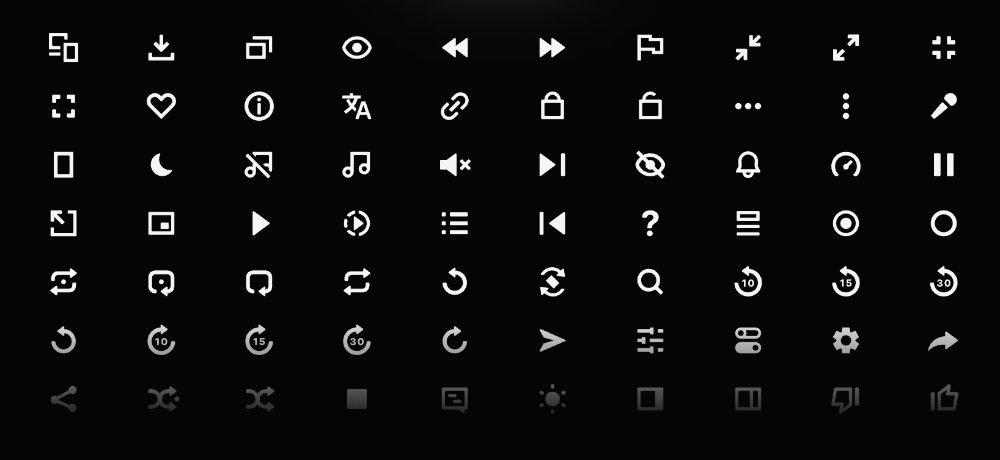

# Video.js Icons

[![package-badge]][package]

Video.js Icons is an open-source and beautifully hand-crafted collection of media icons, originally
designed by the [Vidstack][vidstack] team specifically for building audio and video players. Our
icons are bold, clean, and consistent. All of the icons are free for both personal and commercial use.

The icons can be used in any of the following ways:

- [Web Component](#web-component)
- [JS Frameworks](#js-frameworks)
- [SVG](#svg)
- [SVG Paths](#svg-paths)



## Web Component

Install the package:

```ts
npm i @vjs-10/icons
```

Register the `<vjs-icon>` element:

```ts
import '@vjs-10/icons/element';
```

Use the element (icons are lazy loaded):

```html
<vjs-icon type="play"></vjs-icon>
```

## JS Frameworks

We recommend using [unplugin-icons][unplugin-icons] as it has many bundler (Vite/Rollup/Webpack),
framework (React/Vue/Preact/Solid/Svelte) and customization options.

First, install the package:

```bash
npm i @vjs-10/icons
```

Next, you'll need to configure the plugin like so:

```js
import { ExternalPackageIconLoader } from 'unplugin-icons/loaders';

Icons({ customCollections: ExternalPackageIconLoader('@vjs-10/icons') });
```

Finally, you can import the icons like so:

```js
// Replace {name} with the icon name.
import ... from '~icons/vjs/{name}';

// Examples
import PauseIcon from '~icons/vjs/pause';
import PlayIcon from '~icons/vjs/play';
```

## SVG

The raw SVG files can be imported from this package like so:

```js
// Replace {name} with the icon name.
import ... from '@vjs-10/icons/svg/{name}.svg';
// Examples
import PauseIcon from '@vjs-10/icons/svg/pause.svg';
import PlayIcon from '@vjs-10/icons/svg/play.svg';
```

## SVG Paths

The raw SVG paths can be imported from this package like so:

```js
// camelCase variant of the icon name
import { pausePaths, playPaths, ... } from '@vjs-10/icons';
```

```js
// All SVG paths (server-side)
import { paths } from '@vjs-10/icons';

paths.play; // string
paths.pause;
// ...
```

```js
// Dynamically loaded SVG paths (client-side)
import { lazyPaths } from '@vjs-10/icons';

lazyPaths.play(); // Promise<string>
lazyPaths.pause();
// ...
```

It's expected that the SVG paths are inserted into an `<svg>` element as `innerHTML` with the
following setup:

```html
<svg width="32" height="32" viewBox="0 0 32 32" fill="none" xmlns="http://www.w3.org/2000/svg" aria-hidden="true"></svg>
```

## 📝 License

Video.js Icons is [MIT licensed](./LICENSE).

[vidstack]: https://vidstack.io
[package]: https://www.npmjs.com/package/@vjs-10/icons
[package-badge]: https://img.shields.io/npm/v/@vjs-10/icons
[unplugin-icons]: https://github.com/antfu/unplugin-icons
